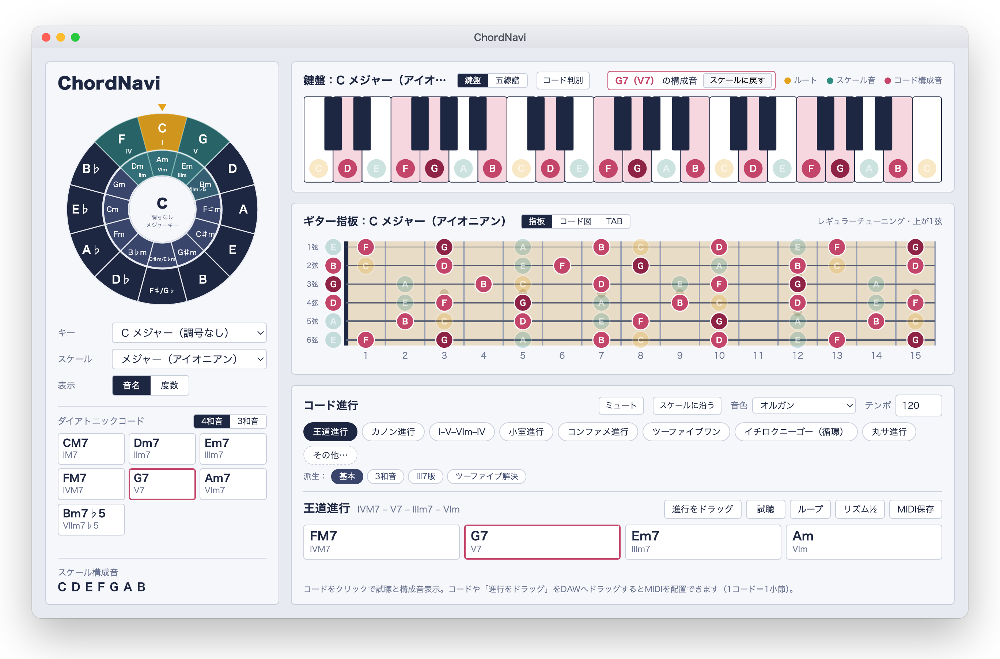
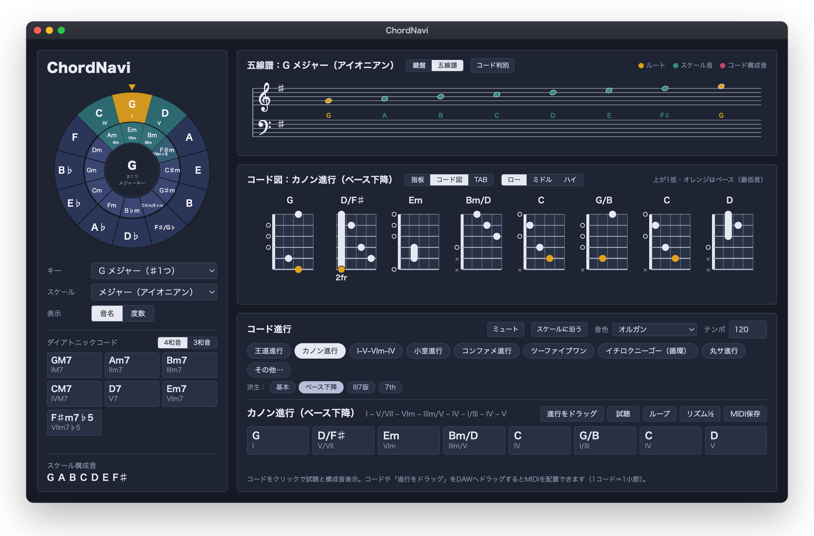
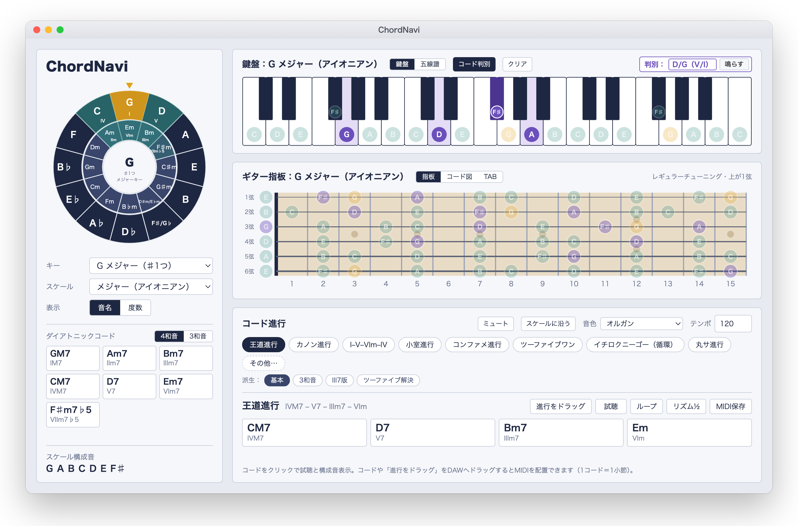

# ChordNavi

ChordNavi は、五度圏・スケール・鍵盤・ギター指板・コード進行を1画面で確認し、コードや進行を **MIDI として DAW へドラッグ＆ドロップ**できるプラグインです。

  



---

## スクリーンショット

| ダークモード＋コード図・五線譜 | コード判別（D/G などのオンコードも） |
|---|---|
|  |  |

---

## 主な機能

| 機能 | 概要 |
|---|---|
| **五度圏** | クリックしたキーが上に来るよう回転。ダイアトニックの位置と度数を表示 |
| **鍵盤／五線譜** | 3オクターブの鍵盤と大譜表を切替。スケール音・コード構成音を色分け、押すと試聴 |
| **ギター指板** | 0〜15フレット。押すと試聴。「コード図」「TAB」に切り替えると、選んだコードの3ポジションや進行全体のフォームを表示 |
| **スケール** | メジャー、各種マイナー、チャーチモード、ペンタ、ブルース、ホールトーン、ディミニッシュ、オーギュメントなど15種と、コードトーン（M7・m7・7・m7♭5・dim7） |
| **ダイアトニックコード** | 4和音／3和音を切替。クリックで試聴、ドラッグで MIDI |
| **コード進行** | 王道・カノン・小室・丸サなど定番の進行と派生形、「その他」から追加の進行。ループ試聴、リズム½ |
| **コードの一時変更** | 進行のコードのルート・種類（7th・add9 など）・ベース（分数コード・オンコード）を変更、1小節を2拍×2に分割・結合 |
| **コード判別** | 鍵盤・指板で音を選ぶとコード名の候補を表示（分数コード・オンコード対応） |
| **MIDI 出力** | ドラッグ＆ドロップ、または「MIDI保存」。1コード＝1小節（分割時は2拍） |
| **試聴の音色** | シンプル／ピアノ／エレピ／ギター／オルガン／パッド |
| **テンポ** | DAW 上では DAW のテンポに同期（切替可） |
| **MIDI キーボード入力** | 弾いた音を鳴らし、鍵盤・指板を光らせてコード名を表示 |
| **スケールに沿う** | 選んだスケール（チャーチモード・各マイナー）に合わせて進行とダイアトニックを置き換え |
| **テーマ** | ライト／ダーク／自動。Standalone は「オプション → テーマ」、DAW 上はタイトル横のボタン |
| **その他** | Space キーで試聴／停止、ミュートボタン |

---

## 対応環境

- **macOS** 11 以降（Apple Silicon／Intel どちらも可）：AU・VST3・Standalone
- **Windows** 10／11（64bit）：VST3・Standalone（「Microsoft Edge WebView2 ランタイム」が必要。Windows 11 と更新済みの Windows 10 には入っています）
- AU は Logic Pro・GarageBand など、VST3 は Ableton Live・Cubase・Studio One・Bitwig・Reaper・FL Studio など

---

## インストール

### macOS

1. [Releases](../../releases) から `ChordNavi-<バージョン>-macOS.pkg` をダウンロードします。
2. `.pkg` を開いてインストールします。次の場所に入ります。
   - AU：`/Library/Audio/Plug-Ins/Components/ChordNavi.component`
   - VST3：`/Library/Audio/Plug-Ins/VST3/ChordNavi.vst3`
   - Standalone：`/Applications/ChordNavi.app`
3. DAW を起動し、プラグインを再スキャンします（Logic は起動時に自動で確認されます）。
4. **音源（インストゥルメント）** トラックに「ChordNavi」を挿します。

### 「開発元を確認できない」と表示されたとき

現在の配布版は Apple の公証を受けていないため、初回に警告が出ます。次のどちらかで一度だけ許可してください。

- `.pkg` を **右クリック（control＋クリック）→「開く」→「開く」**
- または、一度開こうとした後に **システム設定 →「プライバシーとセキュリティ」→「このまま開く」**

### アンインストール（macOS）

次の3つを削除します。

```
/Library/Audio/Plug-Ins/Components/ChordNavi.component
/Library/Audio/Plug-Ins/VST3/ChordNavi.vst3
/Applications/ChordNavi.app
```

### Windows

1. [Releases](../../releases) から `ChordNavi-<バージョン>-Windows-x64-Setup.exe` をダウンロードして実行します。
   - VST3：`C:\Program Files\Common Files\VST3\ChordNavi.vst3`
   - Standalone：`C:\Program Files\ChordNavi\ChordNavi.exe`（スタートメニューに登録）
2. 「Windows によって PC が保護されました」と表示されたら、**「詳細情報」→「実行」** を選びます（署名していないため）。
3. DAW でプラグインを再スキャンし、**音源（インストゥルメント）** として挿します。
4. アンインストールは「設定」→「アプリ」から「ChordNavi」を選びます。

---

## 使い方のヒント

- コードのチップや「進行をドラッグ」を DAW の MIDI トラックへドラッグすると、MIDI クリップが置かれます。
- 試聴の音は、DAW がこのトラックの音声を処理しているときに鳴ります。鳴らないときはトラックを選択（録音待機）してください。
- 進行のチップをクリックすると、下のバーでルート・種類の変更や分割・結合ができます（一時的な変更で、進行を切り替えると元に戻ります）。

---

## ビルド方法（開発者向け）

必要なもの：CMake 3.22 以上、Xcode（コマンドラインツール）。JUCE 8 は CMake の FetchContent で自動取得します。

```bash
cmake -S . -B build-release -DCMAKE_BUILD_TYPE=Release
cmake --build build-release --config Release
./scripts/package_macos.sh          # build-release/packages/ に .pkg を作成
```

単体テスト：

```bash
cmake -S . -B build -DCMAKE_BUILD_TYPE=Debug
cmake --build build --target MidiExportTests
./build/MidiExportTests_artefacts/Debug/MidiExportTests
```

タグ `v*` を push すると GitHub Actions が `.pkg` をビルドして Release に添付します。

---

## 紹介用の画像

SNS などでの紹介には [`assets/screenshots/social-card.png`](assets/screenshots/social-card.png)（2400×1350、16:9）を使えます。

---

## ライセンス

JUCE 8 を使用しています。
